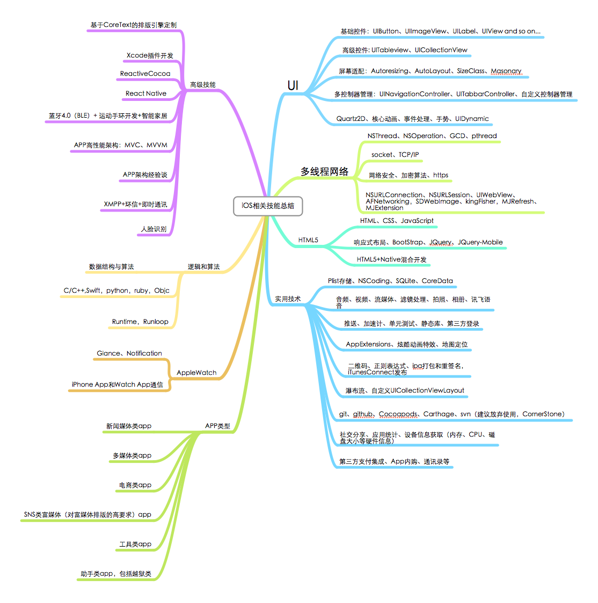

=========


##TODO
- [x] [iOS资深开发者必备基础技能总结](#iOS资深开发者必备基础技能总结)
- [x] [参考资料](#参考资料)
- [x] [十个值得思考的问题](#十个问题)
 

## <a id="iOS资深开发者必备基础技能总结"></a> iOS资深开发者必备基础技能

####

- **<font size= 10>UI</font>**
  - 基础控件：UIButton、UIImageView、UILabel、UIView and so on...
  - 高级控件：UITableview、UICollectionView主要任务是高级控件的性能优化工作
  - 屏幕适配：Autoresizing、AutoLayout、SizeClass、Masonary
  - 多控制器管理：UINavigationController、UITabbarController、自定义控制器管理
  - Quartz2D、核心动画、事件处理、手势、UIDynamic
  
  
- **<font size= 10>高级技能</font>**
  - UNIX环境高级编程
  - UNIX环境网络编程
  - 基于CoreText的排版引擎定制
  - Xcode插件开发
  - ReactiveCocoa
  - React Native
  - 蓝牙4.0（BLE）+ 运动手环开发+智能家居
  - APP高性能架构：MVC、MVVM、MbMVC
  - iOS编码设计模式的深度理解代理、单例、工厂、观察者等
  - APP架构经验谈
  - XMPP+环信+即时通讯
  - 人脸识别 (face++) 
  
- **<font size= 10>多线程网络</font>**
  - NSThread、NSOperation、GCD、pthread
  - socket、TCP/IP
  - 网络安全、加密算法、https
  - NSURLConnection、NSURLSession、UIWebView、AFNetworking，SDWebImage、kingFisher，MJRefresh、MJExtension
  
- **<font size= 10>HTML5</font>**
  - HTML、CSS、JavaScript
  - 响应式布局、BootStrap、JQuery、JQuery-Mobile
  - HTML5+Native混合开发
- **<font size= 10>逻辑和算法</font>**
  - 数据结构与算法
  - C/C++,Swift，python，ruby，Objc
  - Runtime，Runloop
- **<font size= 10>实用技术</font>** 
  - Plist存储、NSCoding、SQLite、CoreData
  - 音频、视频、流媒体、滤镜处理、拍照、相册、讯飞语音
  - 推送、加速计、单元测试、静态库、第三方登录
  - AppExtensions、炫酷动画特效、地图定位
  - 二维码、正则表达式、ipa打包和重签名，iTunesConnect发布
  - 瀑布流、自定义UICollectionViewLayout
  - git、github、Cocoapods、Carthage、svn（建议放弃使用，CornerStone）
  - 社交分享、应用统计、设备信息获取（内存、CPU、磁盘大小等硬件信息）
  - 第三方支付集成、App内购、通讯录等
- **<font size= 10>AppleWatch</font>**
  - Glance、Notification
  - iPhone App和Watch App通信
- **<font size= 10>APP类型</font>**
  - 新闻媒体类app
  - 多媒体类app
  - 电商类app
  - SNS类富媒体（对富媒体排版的高要求）app
  - 工具类app
  - 助手类app，包括越狱类
 

##<a id="十个问题">十个问题

- 你使用过Objective-C的运行时编程（Runtime Programming）么？如果使用过，你用它做了什么？你还能记得你所使用的相关的头文件或者某些方法的名称吗？
- 你实现过多线程的Core Data么？NSPersistentStoreCoordinator，NSManagedObjectContext和NSManagedObject中的哪些需要在线程中创建或者传递？你是用什么样的策略来实现的？
- Core开头的系列的内容。是否使用过CoreAnimation和CoreGraphics。UI框架和CA，CG框架的联系是什么？分别用CA和CG做过些什么动画或者图像上的内容。（有需要的话还可以涉及Quartz的一些内容）
- 是否使用过CoreText或者CoreImage等？如果使用过，请谈谈你使用CoreText或者CoreImage的体验。
- NSNotification和KVO的区别和用法是什么？什么时候应该使用通知，什么时候应该使用KVO，它们的实现上有什么区别吗？如果用protocol和delegate（或者delegate的Array）来实现类似的功能可能吗？如果可能，会有什么潜在的问题？如果不能，为什么？（虽然protocol和delegate这种东西面试已经面烂了...）
- 你用过NSOperationQueue么？如果用过或者了解的话，你为什么要使用NSOperationQueue，实现了什么？请描述它和GCD的区别和类似的地方（提示：可以从两者的实现机制和适用范围来描述）。
- 既然提到GCD，那么问一下在使用GCD以及block时要注意些什么？它们两是一回事儿么？block在ARC中和传统的MRC中的行为和用法有没有什么区别，需要注意些什么？
- 您是否做过异步的网络处理和通讯方面的工作？如果有，能具体介绍一些实现策略么？
- 对于Objective-C，你认为它最大的优点和最大的不足是什么？对于不足之处，现在有没有可用的方法绕过这些不足来实现需求。如果可以的话，你有没有考虑或者实践过重新实现OC的一些功能，如果有，具体会如何做？
- 你实现过一个框架或者库以供别人使用么？如果有，请谈一谈构建框架或者库时候的经验；如果没有，请设想和设计框架的public的API，并指出大概需要如何做、需要注意一些什么方面，来使别人容易地使用你的框架。

##<a id="参考资料"></a>参考资料   
  - [国内优秀开发者博客](https://github.com/tangqiaoboy/iOSBlogCN)  
  - [objc.io](http://www.objc.io/)  
  - [RayWenderlich](http://www.raywenderlich.com)  
  - [iOS Developer Tips](http://iosdevelopertips.com)  
  - [iOS Dev Weekly](http://iosdevweekly.com)  
  - [NSHipster](http://nshipster.com)  
  - [bartosz Ciechanowski](http://ciechanowski.me)  
  - [Big Nerd Ranch Blog](http://blog.bignerdranch.com)  
  - [Nils Hayat](http://nilsou.com/)    
  - [swift](https://github.com/ddapps/Swift)  
  - [开发资源整理](https://github.com/lyfeyaj/awesome-resources)  

##<a id="工具"></a>工具
- [项目依赖管理工具CocoaPods](http://code4app.com/article/cocoapods-install-usage)   
- [项目依赖管理工具Carthage](http://www.isaced.com/post-265.html)  
- 应用内测分发 [蒲公英](http://www.pgyer.com/) 和 [Fir.im](fir.im)
- 网络抓包分析工具 [Charles](http://www.charlesproxy.com/)
- 界面调试工具 [Reveal](http://revealapp.com/)  支持模拟器和真机调试。具体使用教程可以自行Google
- 崩溃日志记录工具 [Crashlytics]()
- 移动统计工具 [Flurry]()
- App Store统计工具 [App Annie]()
- [nomad](http://nomad-cli.com/) nomad是一个方便你操作苹果开发者中心的命令行工具
- Xcode优秀插件   
  - [KSImageNamed]()  
  - [XVim]()  
  - [FuzzyAutocompletePlugin]()  
  - [XToDo]()  
  - [BBUDebuggerTuckAway]()  
  - [SCXcodeSwitchExpander]()  
  - [deriveddata-exterminator]()  
  - [VVDocumentor]()  
  - [ClangFormat]()  
  - [ColorSense]()  
  - [XcodeBoost]()

##Notice
* 不要在init 和 dealloc里面使用点语法
* [提升UITableView性能-复杂页面的优化](http://tutuge.me/2015/02/19/%E6%8F%90%E5%8D%87UITableView%E6%80%A7%E8%83%BD-%E5%A4%8D%E6%9D%82%E9%A1%B5%E9%9D%A2%E7%9A%84%E4%BC%98%E5%8C%96/)  


####关于白盒测试
  1. 可以具体了解AppleScript     **TODO**

####Xcode使用技巧  
  1. Xcode常用的快捷键如下：  
     `cmd + shift + o`     **快速查找类，可以快速跳到指定类的源码中**  
     `ctrl + 6`                          **列出当前文件中的所有方法**  
     `cmd + 1`                            **切换成Project Navigator**  
     `cmd + ctrl + up`                       **在.h和.m文件之间切换**   
     `cmd + enter`                          **切换成standard editor**  
     `cmd + opt + enter`          **切换成 assistant editor**  
     `cmd + shift + y`            **切换console View的现实或隐藏**  
     `cmd + 0`                  **隐藏左边得导航区**   
     `cmd +opt + 0`             **隐藏右边的工具区**  
     `cmd + ctrl + Left/Right `    **到上/下一次编辑的位置**    
     `cmd + opt +j`            **跳转到文件过滤区**     
     `cmd + shift +F`       ** 在工程中查找**     
     `cmd + R `              **运行**   
     `cmd + b`               **编译**   
     `cmd +shift + k `        **清空编译好的文件**   
     `cmd + .`              **结束本次调试**    
     `ESC`                  **调出代码补全功能**   
     `cmd + t`              **新建一个tab栏**  
     `cmd + shift + [`       **在tab栏之间切换**    
     `cmd + 单击`            **查看该方法的实现**   
     `opt + 单击`            **查看该方法的实现**  
  
####为工程增加Daily Build

 1. 增加Daily Build的步骤和好处，这里有一篇[详细文章](http://blog.devtang.com/blog/2012/02/16/apply-daily-build-in-ios-project/)        
 2. **TODO**  


####管理代码片段

 1. 代码片段管理在Xcode整个界面的右下角，可以通过快捷键 `cmd + opt + ctrl + 2` 调出  
 2.代码片段管理如下图所示 ：   
     
   
  
 3. 这里是常用的代码片段管理[代码片段](https://github.com/ddapps/xcode_tool)  


  
####GCD的深入使用
  为了方便的使用GCD，苹果提供了一些方法方便我们将block放在主线程或后台线程执，  
或者延后执行。主要由如下几种：  
  1. 后台执行：
    
```objc
   dispatch_async(dispatch_get_global_queue(0,0),^{  
	//something
}); 
``` 
  2. 主线程执行：  

```objc 
 dispatch_async(dispatch_get_main_queue(),^{
	//something  
});  
```
 3. 一次性执行：  

```objective-C
  static dispatch_once_t onceToken;    
  dispatch_once(&onceToken,^{  
  //code to be executed  
});  
```
  4. 延迟2秒执行：  

```objective-C
  double delayInseconds = 2.0f;  
  dispatch_time_t popTime = dispatch_time(DISPATCH_TIME_NOW,delayInseconds * NSEC_PER_SEC);  
  dispatch_after(popTime,dispatch_get_main_queue(),^(void){  
  //code to be executed on the main queue after delay  
})  
```
  5. dispatch_queue_t也可以自己定义，如果要定义queue，可以使用dispatch_queue_create方法，示例如下：  

```objective-C  
	dispatch_queue_t urls_queue = dispatch_queue_create("blog.ddapps.tolly",NULL);  
  dispatch_async(urls_queue,^{  
	// your code  
});  
  dispatch_release(urls_queue);
```
  
  6. GCD还有一些高级用法，例如让后台两个线程并行执行，然后等两个线程都结束后，再汇  总执行结果。这个可以用dispatch_group 、dispatch_group_async和dispatch_group_notify来实现，示例如下：  
```objective-C
	dispatch_group_t group = dispatch_group_create();  
	dispatch_group_async(group,dispatch_get_global_queue(0,0),^{  
	//并行执行的线程一  
})；  
	dispatch_group_async(group,dispatch_get_globale_queue(0,0),^{  
        //并行执行的线程二  
})；    
	dispatch_group_notify(group,dispatch_get_global_queue(0,0),^{  
	//汇总结果  
})  
```

####Ipa重新签名
* [Ipa重新签名](http://blog.csdn.net/cdztop/article/details/17334487)  

####数据处理  
* [Getting Started with JSONModel](http://code.tutsplus.com/tutorials/getting-started-with-jsonmodel--cms-19840)  
* [Magical Data Modelling Framework for JSON](https://github.com/icanzilb/JSONModel/blob/master/README.md#magical-data-modelling-framework-for-json)  
* [JSONModel](https://github.com/icanzilb/JSONModel)  

####HighLevel复杂网络处理封装
* [AlamoNetwork](https://github.com/ddapps/AlamoNetwork)  

####UITableView性能优化
* 高度缓存，防止重复计算cell高度，[UITableView-FDTemplateLayoutCell](https://github.com/forkingdog/UITableView-FDTemplateLayoutCell) 

####CoreText排版
1. [DTCoreText源码解析1](http://blog.cnbang.net/tech/2630/)  
    `DTCoreText步骤原理： 1.解析HTML生成DOM树  2.解析CSS，合并得到每个DOM节点对应的样式  3. 生成NSAttributeString`  


####相机照片处理相关
1. [AVFoundation 和 GPUImage](http://wang9262.github.io/blog/2014/08/26/avfoundation-related/)


####产品
1. [原型设计工具](https://墨刀.com)
